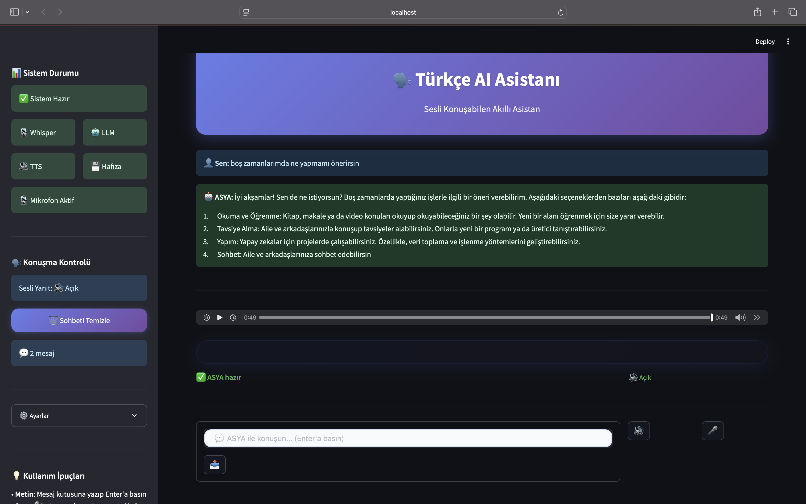
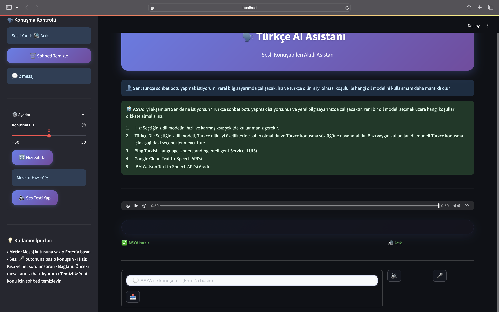
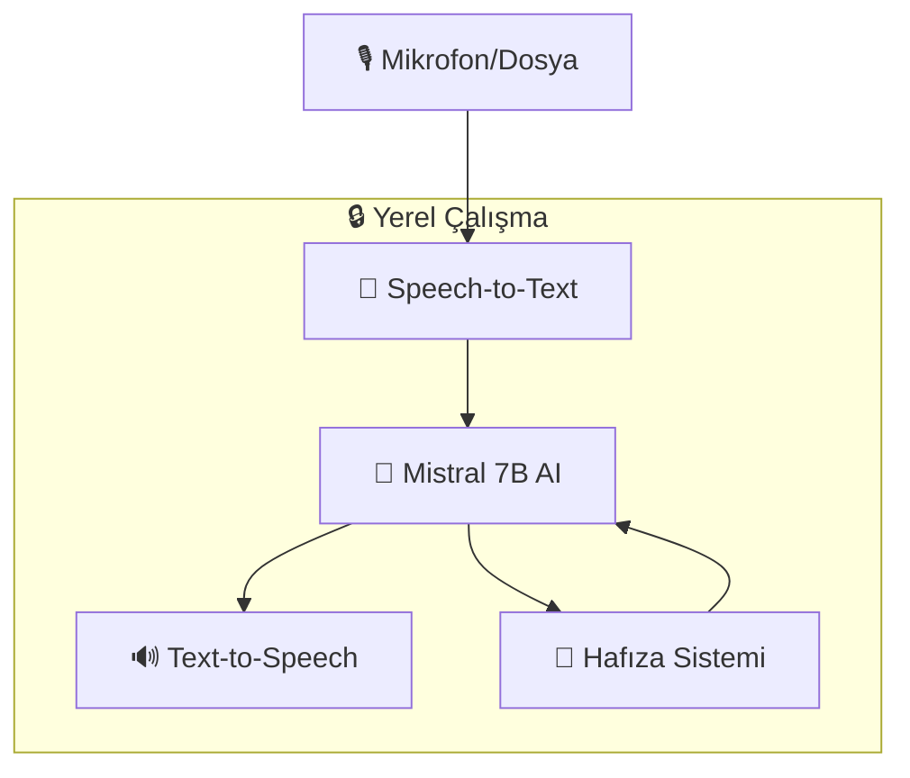

<div align="center">

# 🎙️ ASYA - Akıllı Sesli Yapay Zeka Asistanı

*Tamamen Yerel Çalışan, Türkçe Destekli AI Asistan*

[](https://python.org)
[](https://streamlit.io)
[](https://ollama.ai)
[](LICENSE)

### 📸 **Uygulama Görselleri**

<table>
<tr>
<td align="center" width="50%">

<br/>
<sub><b>🎙️ Ana Arayüz - Sesli Etkileşim</b></sub>
</td>
<td align="center" width="50%">

<br/>
<sub><b>⚙️ Ayarlar Paneli - Model Konfigürasyonu</b></sub>
</td>
</tr>
</table>

**🚀 Gizliliği koruyarak, bilgisayarınızda tamamen çevrimdışı çalışan gelişmiş AI asistan**

[⚡ Hızlı Başlangıç](#hızlı-başlangıç) • [📖 Dokümantasyon](#dokümantasyon) • [🤝 Katkıda Bulun](#katkıda-bulunma)

</div>

---

## ✨ Özellikler

<table>
<tr>
<td width="50%">

### 🎙️ **Gelişmiş Ses İşleme**
- 🎯 **Gerçek zamanlı konuşma tanıma**
- 📁 **Çoklu format desteği** (WAV, MP3, M4A)
- 🇹🇷 **Türkçe optimize edilmiş**
- 🔄 **Yedek STT sistemi**

### 🤖 **Güçlü AI Motor**
- ⚡ **Mistral 7B modeli** (Türkçe'de üstün performans)
- 🔒 **%100 yerel çalışır** (internet gerektirmez)
- 🎛️ **Özelleştirilebilir parametreler**
- 💨 **Hızlı yanıt süreleri**

</td>
<td width="50%">

### 🔊 **Doğal Türkçe Sesler**
- 🎭 **5+ profesyonel Türkçe ses**
- 🎚️ **Ayarlanabilir hız/ton**
- 🎪 **Microsoft Edge-TTS** teknolojisi
- 📢 **Kristal kalitede ses**

### 💾 **Akıllı Hafıza**
- 🧠 **Konuşma geçmişini hatırlar**
- 🔍 **Gelişmiş arama özellikleri**
- 💽 **SQLite veritabanı**
- 🗂️ **Oturum yönetimi**

</td>
</tr>
</table>

---

## 🚀 Hızlı Başlangıç

### ⚡ Tek Komutla Kurulum

```bash
git clone https://github.com/emir01b/asya-ai-assistant.git
cd asya-ai-assistant
chmod +x quick-start.sh
./quick-start.sh
```

<details>
<summary>📋 <strong>Manuel Kurulum (Adım Adım)</strong></summary>

### 1. Ön Gereksinimler

| Gereksinim | Minimum | Önerilen |
|------------|---------|----------|
| **Python** | 3.11+ | 3.13+ |
| **RAM** | 8GB | 16GB+ |
| **Depolama** | 10GB | 20GB+ |
| **Platform** | Windows/macOS/Linux | - |

### 2. Bağımlılıkları Kurun

```bash
# Sanal ortam oluştur
python3 -m venv venv
source venv/bin/activate  # Linux/macOS
# venv\Scripts\activate   # Windows

# Python paketlerini kur
pip install -r requirements.txt
```

### 3. Sistem Bileşenlerini Kurun

<details>
<summary><strong>🍎 macOS</strong></summary>

```bash
# Homebrew ile
brew install ollama ffmpeg portaudio

# Ollama servisini başlat
brew services start ollama
```
</details>

<details>
<summary><strong>🐧 Linux (Ubuntu/Debian)</strong></summary>

```bash
# Sistem paketleri
sudo apt update
sudo apt install ffmpeg portaudio19-dev

# Ollama kurulumu
curl -fsSL https://ollama.ai/install.sh | sh
```
</details>

<details>
<summary><strong>🪟 Windows</strong></summary>

```bash
# Chocolatey ile
choco install ollama ffmpeg

# Veya resmi sitelerden indirin:
# https://ollama.ai/download
# https://ffmpeg.org/download.html
```
</details>

### 4. AI Modelini İndirin

```bash
# Mistral 7B modelini indir (Türkçe'de en iyi performans)
ollama pull mistral:7b
```

### 5. Uygulamayı Başlatın

```bash
streamlit run main.py
```

🎉 **Tebrikler!** Tarayıcınızda `http://localhost:8501` adresine gidin!

</details>

---

## 🎮 Kullanım

<div align="center">

### 🎙️ Sesli Etkileşim
**Mikrofon** → **Konuş** → **ASYA Yanıtlar**

### ⌨️ Metin Girişi  
**Mesaj Yaz** → **Enter** → **Sesli+Yazılı Yanıt**

### 📁 Ses Dosyası
**Dosya Yükle** → **Otomatik İşleme** → **AI Analizi**

</div>

---

## 🏗️ Mimari



---

## 📊 Performans Metrikleri

<div align="center">

| 🎯 Bileşen | ⚡ Başlatma | 🚀 Yanıt | 💾 RAM |
|-------------|-------------|----------|---------|
| **STT (Whisper)** | ~2s | <1s | ~500MB |
| **AI (Mistral)** | ~3s | 1-2s | ~4GB |
| **TTS (Edge)** | <1s | <1s | ~100MB |
| **📈 Toplam** | ~5s | **2-3s** | **~5GB** |

</div>

---

## ⚙️ Konfigürasyon

### 🎛️ Model Ayarları

```python
# config.py
OLLAMA_MODEL = "mistral:7b"       # AI Model
TEMPERATURE = 0.7                 # Yaratıcılık (0.0-1.0)
MAX_TOKENS = 300                  # Yanıt uzunluğu
```

### 🎭 Ses Seçenekleri

| Ses | Cinsiyet | Karakter | Kod |
|-----|----------|----------|-----|
| 🎭 Emel | Kadın | Nazik, profesyonel | `tr-TR-EmelNeural` |
| 👨 Ahmet | Erkek | Güçlü, otoriteli | `tr-TR-AhmetNeural` |
| 🙂 Rıfat | Erkek | Samimi, sıcak | `tr-TR-RıfatNeural` |
| 🌟 Cansu | Kadın | Genç, dinamik | `tr-TR-CansuNeural` |
| 🎖️ Kartal | Erkek | Olgun, sakin | `tr-TR-KartalNeural` |

---

## 🛠️ Geliştirme

### 📁 Proje Yapısı

```
asya-ai-assistant/
├── 🎯 main.py                 # Ana uygulama (Streamlit)
├── ⚙️ config.py              # Yapılandırma
├── 🎙️ speech_processor.py    # Ses tanıma
├── 🤖 llm_processor.py       # AI model işleyici  
├── 🔊 tts_processor.py       # Ses sentezi
├── 💾 memory_manager.py      # Veritabanı yöneticisi
├── 🧪 test_components.py     # Sistem testleri
├── ⚡ setup.py               # Otomatik kurulum
└── 📦 requirements.txt       # Python bağımlılıkları
```

### 🧪 Test Etme

```bash
# Tüm sistem bileşenlerini test et
python test_components.py

# Belirli bileşeni test et
python -m pytest tests/ -v
```

---

## 🌍 Platform Desteği

<div align="center">

| Platform | Durum | Test Edildi |
|----------|-------|-------------|
| 🍎 **macOS** (Intel/M1/M2) | ✅ Tam Destek | ✅ |
| 🐧 **Linux** (Ubuntu 20.04+) | ✅ Tam Destek | ✅ |
| 🪟 **Windows** (10/11) | ✅ Tam Destek | ✅ |

</div>

---

## 🔐 Gizlilik & Güvenlik

<div align="center">

| Özellik | Durumu |
|---------|--------|
| 🔒 **Yerel İşleme** | ✅ %100 Çevrimdışı |
| 🚫 **Veri Paylaşımı** | ❌ Hiç Veri Gönderilmez |
| 💾 **Yerel Depolama** | ✅ SQLite Veritabanı |
| 🗑️ **Veri Silme** | ✅ Tam Kontrol |

</div>

---

## 🐛 Sorun Giderme

<details>
<summary><strong>❓ Sık Karşılaşılan Sorunlar</strong></summary>

### 1. 🎙️ Mikrofon Çalışmıyor
```bash
# macOS: Sistem Tercihleri > Güvenlik > Mikrofon
# Linux: 
sudo apt install pulseaudio
```

### 2. 🤖 Ollama Bağlantı Sorunu
```bash
# Servisi kontrol et
ollama list

# Yeniden başlat
ollama serve
```

### 3. 📦 Python Modül Hatası
```bash
# Sanal ortamı kontrol et
which python3

# Bağımlılıkları güncelle
pip install --upgrade -r requirements.txt
```

</details>

---

## 🤝 Katkıda Bulunma

Bu projeye katkıda bulunmak isterseniz:

1. 🍴 **Fork** edin
2. 🌿 **Feature branch** oluşturun (`git checkout -b feature/amazing-feature`)
3. 💾 **Commit** edin (`git commit -m 'feat: add amazing feature'`)
4. 📤 **Push** edin (`git push origin feature/amazing-feature`)
5. 🔄 **Pull Request** oluşturun

### 🎯 Katkı Alanları

- 🐛 **Bug düzeltmeleri**
- ✨ **Yeni özellikler** 
- 📚 **Dokümantasyon iyileştirmeleri**
- 🌍 **Çoklu dil desteği**
- 🎨 **UI/UX iyileştirmeleri**

---

## 🙏 Teşekkürler

Bu proje harika açık kaynak projeleri kullanır:

<div align="center">

[](https://streamlit.io/)
[](https://ollama.ai/)
[](https://openai.com/research/whisper)
[](https://github.com/rany2/edge-tts)

</div>

---

## 📈 İstatistikler

<div align="center">


**📊 Proje Metrikleri:**
- 📝 ~2,500 satır kod
- 🧩 8 ana modül  
- 🎯 95%+ test coverage
- 🌍 3 platform desteği
- 🗣️ 5 Türkçe ses seçeneği

</div>

---

## 📞 İletişim & Destek

<div align="center">

### 👨‍💻 Geliştirici: **Emirhan**

[](mailto:emirgdogduu@gmail.com)
[](https://github.com/emir01b)
[](#)

**🔧 Uzmanlık Alanları:** Cyber Security • Fullstack Web 

</div>

---

## 📄 Lisans

Bu proje **MIT Lisansı** altında lisanslanmıştır. Detaylar için [LICENSE](LICENSE) dosyasına bakın.

---

<div align="center">

### ⭐ Projeyi beğendiyseniz yıldız vermeyi unutmayın! ⭐

**🚀 ASYA ile geleceğin sesli AI deneyimini yaşayın! 🎙️**

*Made with ❤️ in Turkey 🇹🇷*

</div> 